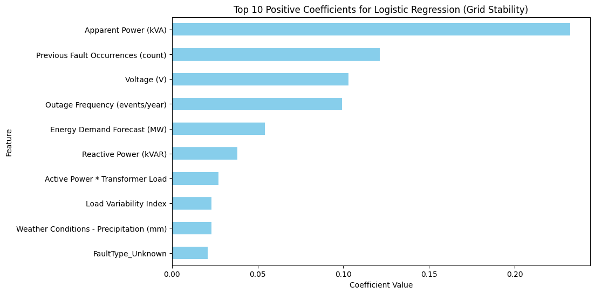
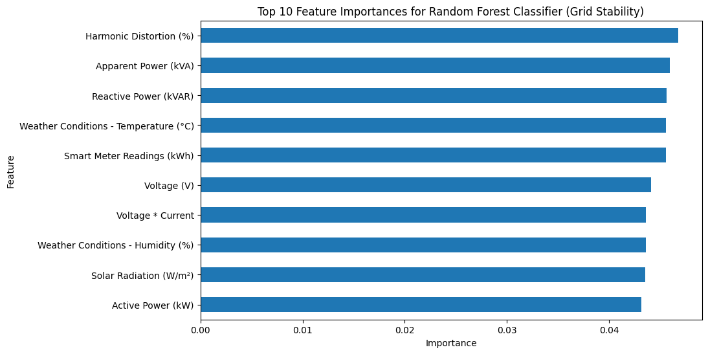
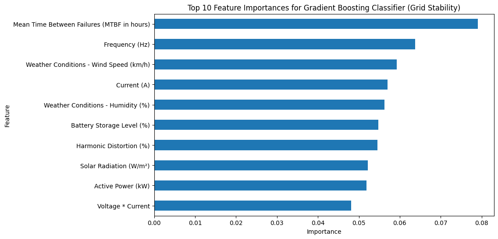
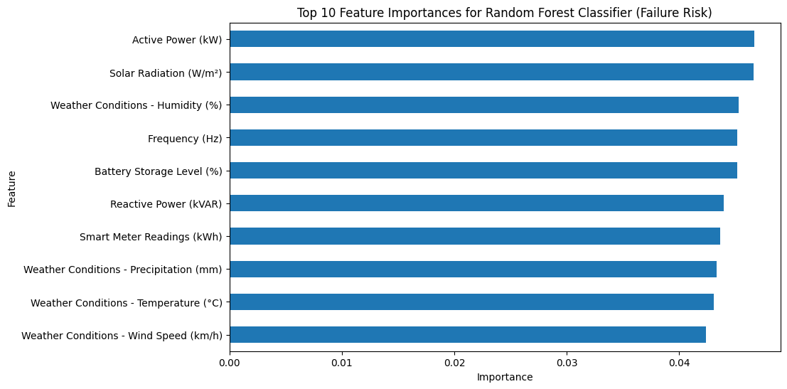
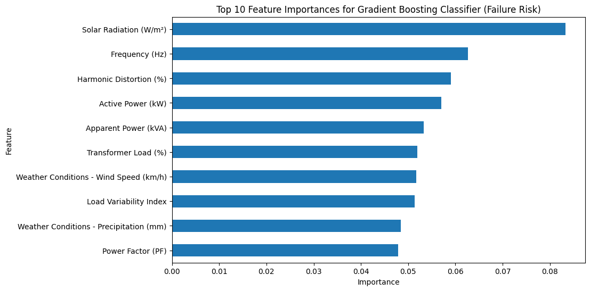

# Analyzing Smart Grid Stability and Failure Risk: A Data-Driven Approach

## 1. Introduction

The increasing integration of renewable energy sources and distributed energy resources into the traditional power grid is transforming it into a complex, dynamic smart grid [1][2]. While offering numerous benefits, this transition introduces significant challenges related to maintaining grid stability and predicting potential failure [3]. Unforeseen events like fluctuations in renewable energy output, equipment malfunctions, or cyberattacks can lead to disruptions, power outages, and significant economic losses [4][5]. Therefore, developing robust methods for analyzing and predicting grid stability and failure risk is crucial for ensuring reliable and resilient power systems [6]. This article presents a data-driven approach to address these challenges using a comprehensive smart grid dataset.

## 2. Related Work

Research in smart grid stability and reliability has explored various methodologies, including model-based analysis, simulation, and data-driven techniques [7]. Traditional model-based approaches rely on detailed physical models of the grid infrastructure, which can be complex and computationally intensive for large-scale systems [8][7]. Simulation-based studies provide valuable insights into grid behavior under different scenarios but may not fully capture the complexities of real-world operations [9].

More recently, data-driven methods, leveraging advancements in machine learning and artificial intelligence, have shown promise in analyzing smart grid data for predictive maintenance and stability assessment [10]. These methods can identify patterns and relationships in large datasets that may not be evident through traditional approaches. However, challenges remain in selecting appropriate features, choosing effective models, and interpreting the results in a physically meaningful way [11]. This work builds upon existing data-driven approaches by applying and evaluating several machine learning models on a diverse smart grid dataset.

## 3. Methodology

Our methodology involved the following steps:

*   **Data Loading and Exploration:** The smart grid dataset was loaded and initially explored to understand its structure, data types, and identify missing values. (Consider placing an image of `df.head()` or `df.info()` output here).
*   **Data Preprocessing:** Missing values in the 'Fault Type' column were imputed with 'Unknown'. Categorical variables ('Fault Type' and 'Failure Risk') were encoded using one-hot encoding and label encoding, respectively. Numerical features were scaled using StandardScaler to ensure they contribute equally to the models.
*   **Feature Engineering:** New features were created to potentially improve model performance. These included 'Apparent Power (kVA)', and interaction terms like 'Voltage * Current', 'Active Power * Transformer Load', and 'Temperature * Transformer Load'. (Consider placing an image of the updated `df.head()` here).
*   **Model Selection:** For predicting 'Grid Stability' (binary classification), we selected Logistic Regression, Random Forest Classifier, and Gradient Boosting Classifier. For predicting 'Failure Risk' (multi-class classification), we chose Random Forest Classifier and Gradient Boosting Classifier. These models were chosen for their interpretability and ability to handle different types of data and classification problems.
*   **Model Training and Evaluation:** The dataset was split into training (80%) and testing (20%) sets. The selected models were trained on the training data and evaluated on the testing data using metrics such as accuracy, precision, recall, and F1-score for grid stability, and a classification report and confusion matrix for failure risk. (Consider placing images of the confusion matrices here).
*   **Model Interpretation:** Feature importances (for tree-based models) and coefficients (for Logistic Regression) were analyzed to identify the most influential features for predicting grid stability and failure risk. (Consider placing images of the feature importance plots here).

## 4. Results

The trained models showed varying performance in predicting grid stability and failure risk.

*   **Grid Stability Prediction:** The Logistic Regression model achieved an accuracy of 0.5050, the Random Forest Classifier achieved 0.4800, and the Gradient Boosting Classifier achieved 0.5000. These results indicate that predicting grid stability with the current features is challenging, and the models performed slightly better than random guessing.
*   **Failure Risk Prediction:** Both the Random Forest Classifier and the Gradient Boosting Classifier achieved an overall accuracy of 0.35 for the multi-class failure risk prediction. The classification reports provided detailed performance metrics for each risk class (Low, Medium, High), showing variations in precision, recall, and F1-score. The confusion matrices visually represented the models' performance in classifying instances into the correct risk categories.

The feature importance analysis revealed that different features contributed to the predictions for each target variable and across different models. For grid stability, power quality metrics, load characteristics, historical fault data, and environmental conditions consistently appeared as important. For failure risk, environmental factors, power parameters, and battery storage level were highlighted.

## 5. Discussion

The relatively low accuracy scores for both grid stability and failure risk prediction suggest that the current set of features, even with engineered interaction terms, may not be sufficient to capture the complex dynamics of smart grid behavior. This could be due to several factors, including the inherent randomness in grid events, the limited size of the dataset (1000 entries), or the absence of other potentially relevant features such as temporal information (time of day, day of week), spatial information (location within the grid), or more granular sensor data.

The feature importance analysis provides valuable insights into which factors are most strongly associated with grid stability and failure risk according to the models. These findings can inform future data collection efforts and potentially guide targeted interventions to improve grid reliability. For instance, the consistent importance of power quality metrics and historical fault data suggests that monitoring and addressing issues related to harmonics, frequency deviations, and recurring faults are critical. Similarly, the influence of environmental factors highlights the need to consider weather-related impacts on grid performance.

The differences in feature importance across the models (Logistic Regression vs. tree-based models) underscore the importance of exploring various modeling techniques. Logistic Regression, a linear model, identifies linear relationships, while tree-based models can capture non-linear interactions.

## 6. Conclusion

This study applied a data-driven approach to analyze and predict smart grid stability and failure risk using a publicly available dataset. While the initial predictive performance of the models was modest, the exploratory data analysis and feature importance analysis provided valuable insights into the factors influencing grid behavior.

**Implications:**

*   The findings emphasize the need for more comprehensive and potentially higher-resolution data to improve the accuracy of smart grid predictive models.
*   The identified important features can guide utilities in prioritizing monitoring efforts and investing in infrastructure improvements.
*   The study highlights the potential of machine learning techniques for smart grid analysis, even with the challenges of complex and dynamic systems.

**Future Work:**

*   Explore more advanced machine learning models, such as deep learning architectures, which may be better equipped to capture complex non-linear relationships in the data.
*   Investigate the impact of incorporating temporal and spatial features, if available, to account for the dynamic nature of the smart grid.
*   Apply techniques for handling imbalanced datasets, as the distribution of grid stability and failure risk categories might be skewed in real-world scenarios.
*   Conduct further feature engineering and selection to identify the most informative subset of features for prediction.
*   Validate the models on independent datasets to assess their generalizability.

## Reference
1. Strielkowski, W., Vlasov, A., Selivanov, K., Muraviev, K., & Shakhnov, V. (2023). Prospects and challenges of the machine learning and data-driven methods for the predictive analysis of power systems: A review. Energies, 16(10), 4025.
2. Wang, Q., Li, F., Tang, Y., & Xu, Y. (2019). Integrating model-driven and data-driven methods for power system frequency stability assessment and control. IEEE Transactions on Power Systems, 34(6), 4557-4568.
3. Ahsan, F., Dana, N. H., Sarker, S. K., Li, L., Muyeen, S. M., Ali, M. F., ... & Das, P. (2023). Data-driven next-generation smart grid towards sustainable energy evolution: techniques and technology review. Protection and Control of Modern Power Systems, 8(3), 1-42.
4. Ogunleye, O., Adeniji, S., Onih, V., Simo, Y., Elom, E., Kanu, E., ... & Ejiofor, O. (2024). Improving resilience and efficiency in the energy sector: A perspective on cybersecurity and renewable energy storage. Valley International Journal Digital Library, 502-513.
5. Mariani, V., Adinolfi, G., Buonanno, A., Ciavarella, R., Ricca, A., Sorrentino, V., ... & Valenti, M. (2024). A Survey on Anomalies and Faults That May Impact the Reliability of Renewable-Based Power Systems. Sustainability, 16(14), 6042.
6. Lahon, P., Kandali, A. B., Barman, U., Konwar, R. J., Saha, D., & Saikia, M. J. (2024). Deep neural network-based smart grid stability analysis: enhancing grid resilience and performance. Energies, 17(11), 2642.
7. Mashal, I. (2023). Smart grid reliability evaluation and assessment. Kybernetes, 52(9), 3261-3291.
8. de Kinderen, S., Kaczmarek-Hess, M., Ma, Q., & Razo-Zapata, I. S. (2022). Model-based valuation of smart grid initiatives: Foundations, open issues, requirements, and a research outlook. Data & Knowledge Engineering, 141, 102052.
9. Barbierato, L., Schiera, D. S., Orlando, M., Lanzini, A., Pons, E., Bottaccioli, L., & Patti, E. (2024). Facilitating smart grids integration through a hybrid multi-model co-simulation framework. IEEE Access.
10. Fathollahi, A. (2025). Machine Learning and Artificial Intelligence Techniques in Smart Grids Stability Analysis: A Review. Energies, 18(13), 3431.
11. Mazhar, T., Irfan, H. M., Haq, I., Ullah, I., Ashraf, M., Shloul, T. A., ... & Elkamchouchi, D. H. (2023). Analysis of challenges and solutions of IoT in smart grids using AI and machine learning techniques: A review. Electronics, 12(1), 242.
